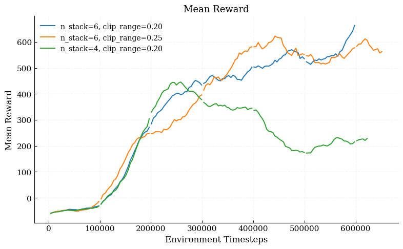
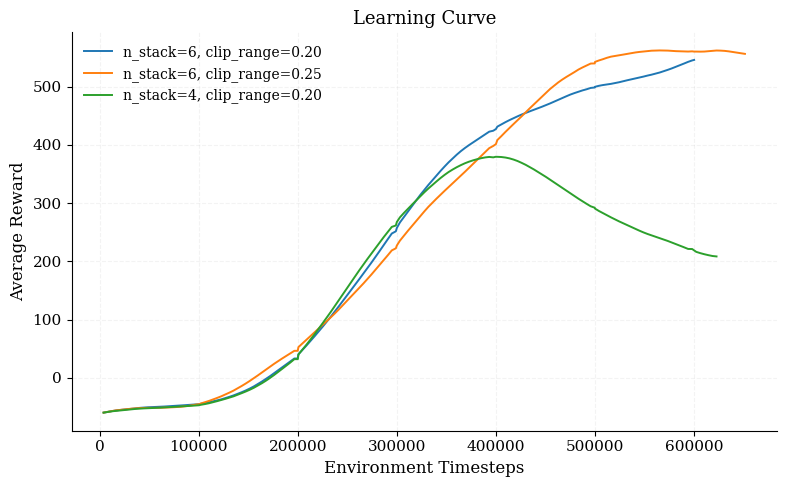
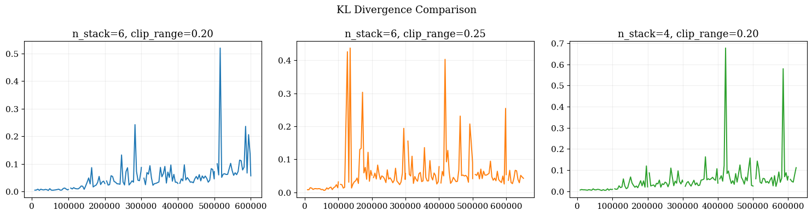
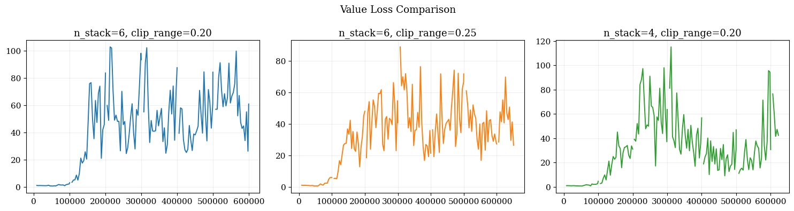
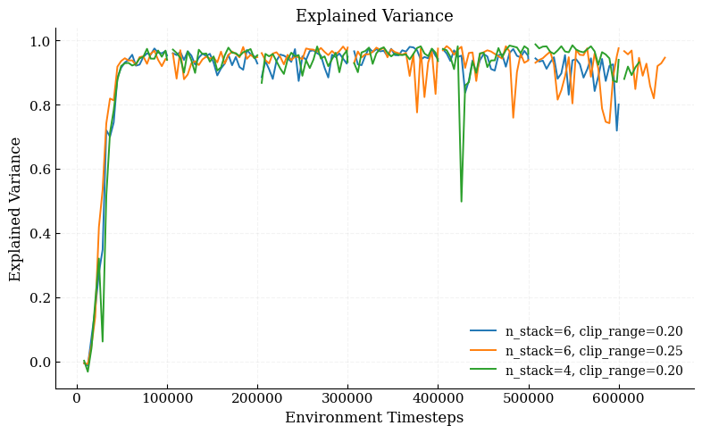
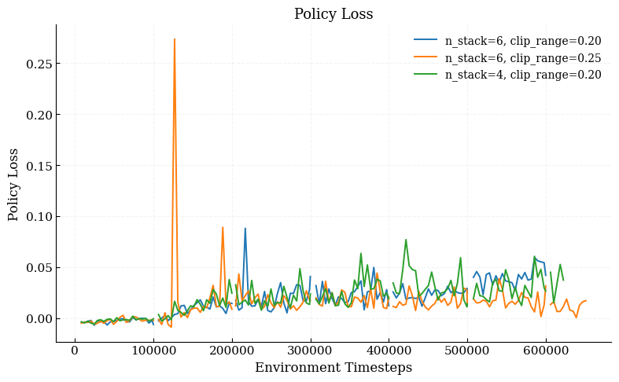
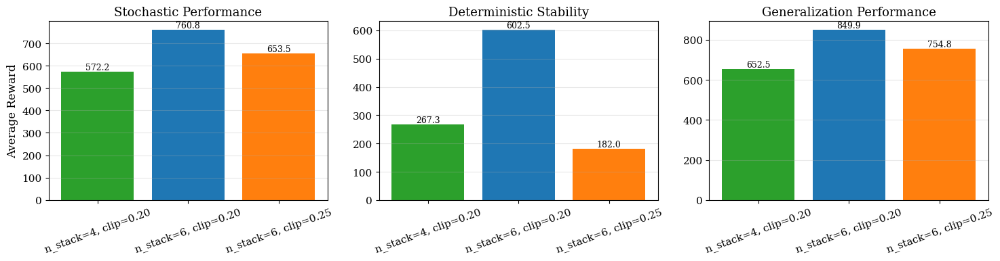

# Autonomous Driving: From Pixels to Decisions

A PPO sensitivity study on Gymnasium `CarRacing-v3`.

Deep reinforcement learning for autonomous driving in the Gymnasium `CarRacing-v3` environment, using Proximal Policy Optimisation (PPO) with a CNN policy. The repository contains a clean, config driven training pipeline and a three way sensitivity study over temporal frame stacking and the PPO clipping range.


## TL;DR

The driving task is modelled as a Markov Decision Process and solved with PPO on raw pixels. Three configurations were trained for one hour each and compared on stochastic reward, deterministic stability, and generalisation to ten unseen track seeds. The best configuration (`n_stack = 6`, `clip_range = 0.20`) reaches roughly 94 percent of the official solved threshold (900) on unseen tracks.

## Results

| Configuration | Total steps | Stochastic reward | Deterministic reward | Generalisation mean | Generalisation std |
|---|---:|---:|---:|---:|---:|
| `n_stack = 6`, `clip = 0.20` (Model A) | 600,000 | **760.8** | **602.5** | **849.9** | **54.9** |
| `n_stack = 6`, `clip = 0.25` (Model C) | 651,264 | 653.5 | 182.0 | 754.8 | 174.4 |
| `n_stack = 4`, `clip = 0.20` (Model B) | 622,592 | 572.2 | 267.3 | 652.5 | 82.5 |

Model A reaches a generalisation capacity of approximately 94 percent relative to the official 900 point solved threshold defined in the Gymnasium CarRacing environment (Farama Foundation, 2025).

### Training curves and final performance

<table>
  <tr>
    <td align="center"><br/><sub>Figure 1. Mean Reward Comparison Between Models</sub></td>
    <td align="center"><br/><sub>Figure 2. Learning Curve Comparison Between Models</sub></td>
  </tr>
  <tr>
    <td align="center"><br/><sub>Figure 3. KL Divergence Comparison Between Models</sub></td>
    <td align="center"><br/><sub>Figure 4. Value Loss Comparison Between Models</sub></td>
  </tr>
  <tr>
    <td align="center"><br/><sub>Figure 5. Explained Variance Comparison Between Models</sub></td>
    <td align="center"><br/><sub>Figure 6. Policy Loss Comparison Between Models</sub></td>
  </tr>
  <tr>
    <td align="center" colspan="2"><br/><sub>Figure 7. Final Performance Comparison Between Models</sub></td>
  </tr>
</table>

## Problem formulation

The driving task is modelled as a Markov Decision Process `M = (S, A, P, R, γ)`:

* **State.** Six stacked grayscale frames resized to 84 by 84, giving `s_t ∈ R^(6 × 84 × 84)`. Stacking is required because vehicle dynamics depend on velocity, which cannot be inferred from a single frame (Inamdar et al., 2024).
* **Action.** Continuous control `a_t = [steer, gas, brake]` with `steer ∈ [-1, 1]`, `gas ∈ [0, 1]`, `brake ∈ [0, 1]` (Farama Foundation, 2025).
* **Reward.** Provided by the environment: positive when a new track tile is visited, with a small penalty of -0.1 at every step.

PPO is selected over off policy alternatives such as SAC for its stability oriented clipped surrogate objective, which is well suited to control tasks where abrupt policy changes can destabilise the vehicle (Schulman et al., 2017; Muzahid et al., 2021).

## Repository layout

```
autonomous-driving-from-pixels-to-decisions/
├── configs/
│   ├── model_A.yaml      # n_stack=6, clip_range=0.20
│   ├── model_B.yaml      # n_stack=4, clip_range=0.20
│   └── model_C.yaml      # n_stack=6, clip_range=0.25
├── src/
│   ├── wrappers.py       # SafeCarAction, SkipZoomWrapper, ImageProcessWrapper
│   ├── callbacks.py      # TimeLimitCallback, linear_schedule
│   ├── env_utils.py      # make_env factory
│   ├── train.py          # config driven training entry point
│   ├── evaluate.py       # stochastic, deterministic, generalisation tests
│   └── record_gif.py     # record a driving GIF from a trained checkpoint
├── scripts/
│   └── run_all.sh        # run all three configurations sequentially
├── results/              # figures from the sensitivity study
├── requirements.txt
└── README.md
```

## Quick start

### 1. Install

```bash
python -m venv .venv
source .venv/bin/activate          # on Windows: .venv\Scripts\activate
pip install -r requirements.txt
```

### 2. Train a single configuration

```bash
python -m src.train --config configs/model_A.yaml
```

Outputs are written under `runs/<run_name>/` (model checkpoints, TensorBoard logs, CSV logs).

### 3. Train all three configurations

```bash
bash scripts/run_all.sh
```

### 4. Evaluate a trained model

```bash
python -m src.evaluate --config configs/model_A.yaml --model-path runs/model_A/best_model.zip
```

This runs the three evaluation protocols from the report: ten stochastic episodes on the training seed, five deterministic episodes, and ten stochastic episodes on unseen seeds for generalisation.

### 5. Record a GIF of the trained agent

```bash
python -m src.record_gif \
    --config configs/model_A.yaml \
    --model-path runs/model_A/models/best_model.zip \
    --output results/agent.gif \
    --seed 101 --max-steps 1000 --fps 30
```

### 6. Watch training in TensorBoard

```bash
tensorboard --logdir runs/
```

## Methodology notes

### State representation

Driving is a continuous process where the vehicle state evolves over time. A single visual observation cannot capture motion related variables such as velocity or direction change. Stacking six consecutive frames allows the agent to implicitly estimate speed and trajectory evolution, which is essential for stable control (Inamdar et al., 2024).

### Action space

A continuous action space is used because discrete actions limit control precision and tend to produce unstable driving behaviour. Vehicle motion is constrained by physical limits such as tyre friction and steering smoothness, so gradual control adjustments better reflect realistic driving dynamics (Lillicrap et al., 2015).

### Sensitivity dimensions

Two design choices are varied while everything else is held constant:

* **Temporal stacking (`n_stack`).** Six frames versus four frames.
* **Clipping range (`clip_range`).** 0.20 versus 0.25. Larger values permit stronger policy updates per epoch.

### Evaluation protocol

Three complementary tests are run on every trained policy:

1. **Stochastic performance.** Ten episodes with action sampling, to estimate potential performance under exploration.
2. **Deterministic stability.** Five episodes with mean actions, to measure consistency of the learned policy.
3. **Generalisation.** Ten episodes on unseen track seeds (`[101, 202, 303, 404, 505, 606, 707, 808, 909, 1000]`).

Reported metrics include mean reward, KL divergence, explained variance, value loss, and policy loss.

## Headline findings

* **Six frames beats four.** With `n_stack = 4`, reward increases early but degrades after roughly 300,000 steps, accompanied by larger KL spikes and value loss oscillations (Figures 3 and 4). The interpretation is physical rather than statistical: motion perception requires information about speed, direction change, and track curvature over time, and a four frame window leaves the value function unable to estimate these reliably. The learning rate also confirms this. Model A reaches the highest reward gain rate at 0.001209 per timestep, against 0.000463 for the four frame model.
* **Tighter clipping is more reliable.** Raising `clip_range` from 0.20 to 0.25 accelerates early reward growth because larger policy updates are allowed per epoch, but introduces aggressive updates that show up as KL and policy loss spikes (Figures 3 and 6). The clearest evidence is the deterministic test, where Model A scores 602.5 while Model C drops to 182.0.
* **Generalisation tracks training stability.** On ten unseen seeds, Model A reaches 849.9 reward with a standard deviation of 54.9, while Model C reaches 754.8 with a standard deviation of 174.4. Models with more stacked frames captured temporal dynamics more effectively, which improved both learning stability and generalisation.
* **Explained variance drops in the four frame model.** All three models reach explained variance close to one early in training (Figure 5), but a significant drop is observed in the four frame configuration, consistent with reduced temporal information.

## Limitations

Training was capped at one hour per run to keep the sensitivity comparison fair, which prevented full convergence. The environment reward function was used as is, with no reward shaping. Both choices are documented limitations in the report.

## References

* El Sallab, A., Abdou, M., Perot, E., and Yogamani, S. (2017). Deep reinforcement learning framework for autonomous driving. *IS&T Electronic Imaging: Autonomous Vehicles and Machines*.
* Farama Foundation. (2025). *Car Racing environment documentation*. https://gymnasium.farama.org/environments/box2d/car_racing/
* Inamdar, R., Sundarr, S. K., Khandelwal, D., Sahu, V. D., and Katal, N. (2024). A comprehensive review on safe reinforcement learning for autonomous vehicle control in dynamic environments. *Results in Engineering*, 22, 100810.
* Lillicrap, T. P. et al. (2015). *Continuous control with deep reinforcement learning*. arXiv:1509.02971.
* Liu, Q., Jiang, Z., Yang, H. J., Khosravi, M., Waite, J. R., and Sarkar, S. (2025). *Enhancing PPO with trajectory aware hybrid policies*. arXiv:2502.15968.
* Mnih, V. et al. (2015). Human level control through deep reinforcement learning. *Nature*, 518(7540), 529 to 533.
* Muzahid, A. J. M., Kamarulzaman, S. F., and Rahman, M. A. (2021). Comparison of PPO and SAC algorithms towards decision making strategies for collision avoidance among multiple autonomous vehicles. *ICSECS ICOCSIM*.
* Schulman, J., Wolski, F., Dhariwal, P., Radford, A., and Klimov, O. (2017). *Proximal policy optimization algorithms*. arXiv:1707.06347.
* Stable Baselines3. (2026). *PPO documentation*. https://stable-baselines3.readthedocs.io/en/master/modules/ppo.html

